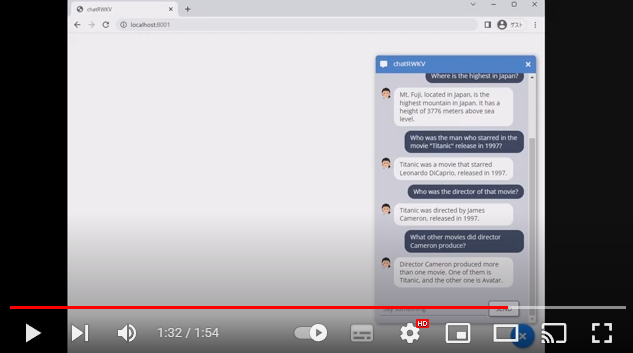

# chatRWKV に WebチャットUI(chatux) をつける

## What is this?

[chatRWKV](https://github.com/BlinkDL/ChatRWKV) を chatux を使って Web チャットボットにする

## ライセンス

Apache 2.0。
本プロジェクト内に内包されているコードは https://github.com/BlinkDL/ChatRWKV をベースにしています。

## 動作確認環境

- Python: 3.9
- GPU CUDA Version: 12
- GPU memory: 24GB
- OS: Ubuntu Desktop 22.04 / Windows 11 

# How to run

## STEP1:clone

本プロジェクトをクローンする

```
https://github.com/riversun/chatux-server-rwkv
```

## STEP2: 関連パッケージのインストール

関連パッケージをインストールします。(※)

```commandline
pip install rwkv fastapi uvicorn
```

（既に CUDA版 pytorch が動作する環境がある前提です。もし実行時エラーが出たら、必要に応じて足りないパッケージをインストールします）


## STEP3: 学習済モデルデータ(重み)の入手

モデルデータには 3b,7b,14b と種類があり、数値が大きいほど、多くのパラメータをもっているので、表現力が高いということになります。
パラメータ数が多いほどGPUのメモリを消費しますので、実行環境にあわせてデータをダウンロードします。

以下は、モデルデータの種類と消費GPUメモリです。

**fp16i8** (fp16学習済データを int8 に量子化する　という意味と思われる) をつかえば、 Accuracy はやや落ちるようですが、使用GPUメモリ容量を減らすことができます。

コード内で指定するときは `cuda fp16` や `cuda fp16i8` のように指定します

<table>
	<tr>
		<td>strategy</td>
		<td>rwkv-4-pile-14b</td>
		<td>rwkv-4-pile-7b</td>
		<td>rwkv-4-pile-3b</td>
	</tr>
	<tr>
		<td>fp16</td>
		<td>28GB</td>
		<td>16GB</td>
		<td>6GB</td>
	</tr>
	<tr>
		<td>fp16i8</td>
		<td>14GB</td>
		<td>8.6GB</td>
		<td>3GB</td>
	</tr>
</table>

以下から、重みデータ(*.pth)のファイルをダウンロードします。


<details>

<summary>BlinkDL/rwkv-4-pile-14b の入手</summary>

### BlinkDL/rwkv-4-pile-14b

- ダウンロード
  - https://huggingface.co/BlinkDL/rwkv-4-pile-14b
  - `RWKV-4-Pile-14B-2023xxxx-ctx8192-testxxx.pth` というファイルが The best general model　だそう

- 消費GPUメモリ
  - 約28GB(fp16) ... メモリ 24GB クラスの GPU でも Out of memory になる
  - 約14GB(fp16i8) ...多少 Accuracy が落ちるらしいが T4でも動作する

- パラメータ

```
args.n_layer = 40
args.n_embd = 5120
args.ctx_len = 8192
```

</details>


<details>

<summary>BlinkDL/rwkv-4-pile-7b の入手</summary>


### BlinkDL/rwkv-4-pile-7b

- ダウンロード
  -https://huggingface.co/BlinkDL/rwkv-4-pile-7b
  - `RWKV-4-Pile-7B-20230109-ctx4096.pth` 

- 消費GPUメモリ
  - 約16GB(fp16)
  - 約8.6GB(fp16i8) 

- パラメータ

```
args.n_layer = 32
args.n_embd = 4096
args.ctx_len = 4096
```

</details>


<details>

<summary>BlinkDL/rwkv-4-pile-3b の入手</summary>


### BlinkDL/rwkv-4-pile-3b

- ダウンロード
  -https://huggingface.co/BlinkDL/rwkv-4-pile-3b
  - `RWKV-4-Pile-3B-20221110-ctx4096.pth` 

- 消費GPUメモリ
  - 約6GB(fp16)
  - 約3GB(fp16i8) 

- パラメータ

```
args.n_layer = 32
args.n_embd = 2560
args.ctx_len = 4096
```

</details>


ダウンロードしたファイルは `[project]/data` フォルダに置きます

## STEP4: 学習済モデルデータ（重み）をコード内にセットする

`chatux-server-rwkv.py` を開いて

- `#specify RWKV strategy,model(weight data)` のあたりに、以下のように `STRATEGY=` と `MODEL_NAME` があるので、それぞれ入力します。 `MODEL_NAME` はファイル名だけでOK。
- `# specify params for weight data` のあたりに、学習済モデルデータ用のパラメータを記載します。↑に示したもののコピペでもOK

```python
# specify RWKV strategy,model(weight data)
STRATEGY = 'cuda fp16i8'
MODEL_NAME = 'RWKV-4-Pile-7B-20230109-ctx4096.pth'

# specify params for weight data
args.n_layer = 32
args.n_embd = 4096
args.ctx_len = 4096
```

## STEP5: チャットサーバーの起動

```commandline
python chatux-server-rwkv.py
```

## STEP6: 実行

サーバーが起動したらブラウザで http://localhost:8001 を開く

**デモ動画**

<a href="https://www.youtube.com/watch?v=t3vuNmIYXBo" target="_blank"></a>
